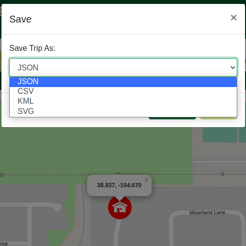

# Introduction

This document describes the architecture and design of a single page web application that interacts with microservices via RESTful APIs.
The key elements in this document include the architecture, user interface, client components, and server classes.

This is a living document that is updated as changes are made each sprint.
The initial document describes the Base code students are given as a starting point for the semester.
Students are expected to update this document as changes are made each sprint to reflect the evolution of their application and key decisions they make.
The Base section serves as an example.

# Base

The Base is a simple application to provide the architecture to the students at the beginning of the semester.
The JavaScript code will be useful examples for students to learn from and leverage in the code they write for sprint 1.
The progressive display of information using collapsible sections and popups will serve as examples of good user interface design.
The overall design is somewhat minimalist/simple for the intended mobile device audience.

### Architecture

The Base architecture is a JavaScript single page web application in an HTML5 browser that uses RESTful APIs to access Micro-services provided by a Java server running on Linux.
The client consists of a minimal index.html file that loads and executes the bundled JavaScript application.
The client and server files are bundled into a single JAR file for execution on the Linux server at a specified port.
The browser fetches the client files from the server on the specified port.

The browser loads the index.html file (by default) which in turn loads the bundled JavaScript single page application bundle.js.
* The single page application makes RESTful API requests to the server on the same port using  JavaScript's asynchronous fetch.  
* A protocol document describes the JSON format for the RESTful API requests and responses.
* JSON Schemas are used to verify requests on the server side and responses on the client side.
* On the client, ReactJS renders the application using ReactStrap, Leaflet, and application defined components.
* GSON is used on the server to convert JSON requests to Java objects and Java objects to JSON responses.
* The client (ulog) and server (SLF4J) logging mechanisms control debugging output during development and production - print statements and console logging should never be used. 

The following architecture elements are not included in the Base system.
They will be added later in the semester.
* Client filesystem .
* Server SQL .
* Server concurrency.

### User Interface

The basic screen in black shows the view on a mobile device, with a header, footer, and map.
The header contains a earth logo and the team name obtained from the server when the client was loaded.
The footer contains a connection icon along with the current server name and server URL the client is connected to.
The blue areas highlight the actions that may be performed.

Rather than buttons or icons to signify actions, we are associating actions with elements that are already on the screen to reduce the clutter.
We are using both popups and collapsible sections in this design rather than choosing to use one exclusively.
* Collapsible/Hidden sections are used for the map and about sections since they have a significant amount of content and we don't need to see them at the same time.
* A popup is used for the URL change since we want to control the interaction until the operation is completed. It seemed more natural than another collapsible section.

#### Clicking on the map places a marker.
Whenever a user clicks on the map, the client should display a marker with latitude and longitude at that location.
We only maintain a single marker at this point displaying the most recently clicked location.

#### Clicking on the team name should tell me more about the team.
Whenever a user clicks the team name in the header, a collapsible section should appear under the header with information about the team.
The collapsible map should disappear so only the about or map are displayed.
A close button / icon in the top right corner of the about will close the about and return the map to display.
A simple toggle in state should be able to control this rendering.
The about page should contain the team name as a heading, but be otherwise blank in base. 

#### Clicking on the URL in the footer should let me change the server.
Whenever a user clicks on the URL a popup should open showing the team name, the URL in an input text box, and a Cancel button.
When the user modifies the URL, a Test button should appear and the server name should disappear.
When the Test button is clicked, it will attempt to connect to the server.
If not successful, nothing changes and the user may continue to make URL changes or click the Cancel button to return to the original sever (it shouldn't change).
If successful, the new server name should appear and a Save button should replace the Test button.
When the user clicks the Save button, the server connection should change and the popup closes, revealing the new servername and URL in the footer.

### Component Hierarchy
The component hierarchy for the base application depicted below shows the our top level App component with four children components.
* App renders the major components on the screen.
* Header renders an icon and a team name in the top banner.
* Footer renders the current server connection in the bottom footer.
* Atlas renders a map.
* About renders information about the team.

We do not show the many ReactStrap components in this hierarchy, even though they will appear when you are debugging on the client.

### Class Diagram
The class diagram for the base application depicted below shows the basic structure of the web server application.

The classes in blue represent the classes specific to this application.  
* WebApplication processes command line parameters and creates MicroServer.
* MicroServer start a web server on the given port, configures the server for security, static files, and APIs for different types of requests, and processes the requests as they arrive.
* JSONValidator verifies a request is properly formatted before attempting to process it using JSON Schemas.
* RequestConfig is a specific request that allows the server to respond with its configuration to allow interoperability between clients and servers. 
* RequestHeader defines the basic components of all requests.

The classes in orange represent the external libraries used by the application.
Often there are several related classes but we've listed only one to simplify the diagram.
* GSON converts a JSON string into a Java object instance.
* Spark provides the necessary web support for our MicroServer.
* JSON provides libraries to manipulate JSON objects using the JSON Schema libraries.
* Logger provides a centralized logging facility used in all of the application classes.

# Sprint 1

# Summary:
* This sprint was mainly focused on created and training ourselves on the file structure that we will be using to develop for the rest of the sprints in the future. All team mates were getting used to the version control process, and writing clean, collaborative code stored on github's repos, and created using JavaScript in IntelliJ IDE. 

### Files changed
* The files we changed for this sprint included the Atlas.js and the About.js mainly. 

* For About.js, our team created a skeleton page which included a default class which would render a page with 6 identical sections of code. Each section of code would include a location for an image and a location for information about that section, as well as a title for that section. So each section would have an image, a title and a description. Five of the six sections were used for team members individual names, bios, and an image of that person. The last section was used for our team photo and team information. These were all the changes we made to our About.js.

# Design so far

* For our Atlas.js, we decided to create a button on the bottom of the map which let the user return to center. We created the button and then later added logic as a function inside our Atlas class which actually brought the user view on the web page to the center. 
* Once we created a working button to center our map on the user's location, we added logic again to the Atlas class to have a default marker supplied by react leaflet's libraries to drop on the map at the user's location. Shown in the image below. 

# Example of location pin

# Sprint 2

# Summary:
* The focus of this sprint is to create a UI for entering text that will allow the user to find locations either by name, or by grid coordinate (lat/long). The user will also be able to take two locations and find the distance between them.

### Files chaged:
* The file mostly changed are in Atlas.js. We added numerous react components that allow for better User UI.
* Also added JS files for finding places, using databases, and testing

# UI Changes:
* Shows new search bar functionality

* Shows new coordinate searching ability

* Shows new shortlist of locations

* Shows new Alert that appears with wrong input

# Sprint 3
### Summary: 
In this sprint we implemented a UI for distance searches and for building a trip. These new capabilities will be based inside different tabs as to not clutter the screen. The distance search will allow the user to select two points and the distance between them will be shown. There will also be a line between those two points drawn on the map. On the building a trip tab we will have multiple sections and buttons such as Trip Info, Points, Itinerary, Save, and Load. Trip Info, Points, and Itinerary will have their own window popup to reduce screen usage and as the number of points supported is unlimited. This prevents the map from being pushed all the way to the bottom of the page. The trip section will also have a line drawn between each point on the map.

### Files changed:
Alot of changes came from the Atlas.js file. We as team split that file into several other js files to each represent a component of the UI. We now have GPS.js, Search.js, Tab.js, and Trip.js. The footer was also updated to show that we support version 3 of the protocol and the requests that come with it. Other backend files and json schemas were added as well to implement the trip functionality. This includes RequestTrip.java and ProcessTrip.java. Other files were changed as needed.

### Design so far:

New tab UI added. Default tab will be search.

When the distance tab is selected. Sample distance test is shown.

When the trip tab is selected. Sample trip test is shown.

### Atlas.js refactor:
We refactored Atlas.js into a new structure that breaks the large file up into multiple smaller files that maintains the functionality.

### Client Side Overall UML:

# Sprint 4
### Summary:
In this sprint we plan on adding a few things to the server side of the application including a response time, the ability to convert coordinates to decimal, and a way to filter search results from find. After this the goal will be to improve user experience and expose a few of these new features to the user. We will make it so that a user can request their trip be optimized and we will return the result in less than a second as well as the the user the ability to filter through their search results.

### Files changed:
There will be a fair ammount of changes in most of the server side components including requestFind.java requestDistance.java and requestTrip.java. The misc helper files will be changed as well. After this there will be some changes to our UI in the find tab to give a user the ability to filter search results. Finally there will be a box a user can select if they would like their trip optimized.

### Version 4 Update:
* T09 now supports decimal coordinates.
* UI to select a filter.
* Optimized performance via 2op algorithm
* timer to see performace characteristics

### Breakdown of client code and respective web services provided.
* Atlas
* Renders all client side web services.

* Save/Load
* user can load a previosly saved file for a trip or save their current working file.

* GPS file

* Navigation Bar file

* Search file

* Trip file

# Sprint 5

### Summary:
For Sprint 5, our team will take on 5 epics. These epics will result in new functionality of our website as well as UI changes. The first epic is place details which will allow a user to click the map and instead of returning a lat/long, will return details about that location such as country and a textual description. The next epic is place display, in which, we will have a link to information about that location they select. The third epic we are taking on is file format, which will allow the user to use different file formats for loading trip information. The fourth epic is distance display which will create a user specified selection for what units they want the distance between points displayed in and they will be allowed to create their own type of units. The last epic our team is taking on this sprint is modify trip, this epic allows the user to modify a past saved trip. 

### Files changed:
Most of the changes this sprint will revolve around changes to UI on the client side. We will implement a drop down selection menu for distance display type, buttons to allow users to load and save different trip file formats, a new display for links about locations the user selects. All UI will be written in the atlas.js and supporting files. 

### New UI Changes
* Several changes were made during the sprint involving three major UI changes. 
* The first was for the Distance Units epic where users can not name custom units, with custom earth radius, or select from generic units like Miles, Kilometers and Nautical Miles. 
* 
* And custom units
* 

* The next major change was in allowing the user to get information about a location they searched via a link on our points tab. We also added an option to optimize or to not optimize. 
* 
* And a custom wiki link
* 

* The third major UI change we made was to our save load where we now have several more save file options including JSON, CSV, KML and SVG file formats
* 

